
<h1>Modèle de diffusion d'une maladie mortelle hautement infectieuse dans une population d'agents mobiles</h1>

## Sommaire
1. [Introduction](#introduction)  
2. [Présentation du modèle](#presenration-du-modele)  
   a. [Définition des paramètres](#definition-des-parametres)  
   b. [Présentation des agents](#presentation-des-agents)  
3. [Expériances éffectuées](#experiences-effectuees) 
   a. [Auto-régulation](#auto-regulation)  
   b. [Mesures de contrôle](#mesures-de-controle)
4. [Conclusion](#conclusion)  

&nbsp;  

# 1. Introduction 

Cette étude a été crée dans le but de comprendre comment une maladie mortelle hautement infectieuse (MMHI) se diffuse dans une population d'agents mobiles 
en fontion du temps. Le problème auquel nous sommes confrontés est le suivant : quelles mesures peuvent être prises pour protéger la population en ralentissant 
ou en éliminant la maladie ? Nous commencerons par présenter le modèle mis en place et les agents qui le composent puis nous présenterons et expliquerons les
résultats obtenus.

## 2. Présentation du modèle 

### a. Définition des paramètres 

Pour ce modèle nous avons utilisé l'outil NetLogo, un logiciel de modélisation de simulation. Les paramètres utilisés dans notre étude seront les suivants :
<ul>
    <li>La contagiosité : exprime la probabilité qu'un individu infecté infecte un autre individu. Afin de rester pertinant, la valeur minimum de ce paramètre est de 60 %</li>
    <li>La probabilité de guérison.(min. 10%)</li>
    <li>La durée de l'immunité en semaines. (min. 26; max 52)</li>
    <li>La durée d'infection, on obtient des résultats viables qu'à partir de 20 semaines. Une durée plus grande serais irréaliste.</li>
</ul>

Chaque simulation se terminera si il n'y a plus d'infecté ou si toute la population est morte.

### b. Présentation des agents 

Les agents sont définis par leur état de santé (sain, infecté, immunisé), si il y a suffisamment de place dans le monde, ils peuvent se reproduire. Lorque qu'un agent est infecté, 
il peut guérir ou mourir selon la probabilité de guérison. Les individus se déplacent aléatoirement dans un monde de 80x80 parcelles 
et peuvent contaminer les autres agents en cas de contact physique.

&nbsp;

&nbsp;

# 3. Expériences éffectuées 

N.B. : plusieurs simulations ont été effectuées pour obtenir des résultats significatifs mais nous ne pouvons pas mettre tous les graphiques obtenus dans ce document.  
Nous indiquerons la durée de l'immunité que si cela se révèle pertinant.

### a. Auto-régulation 

Avec certaines valeurs nous observons que la maladie finie par disparaitre d'elle-même car tous les agents infectés sont morts et la population s'est renouvelée. 
Il arrive que la maladie disparaisse après une dizaine d'années, mais en moyenne nous avons estimé qu'elle disparait entre 100 et 300 ans après la première infection.

#### Contagiosité : 60% | Chances de guérison : 0% | Durée de l'immunité : 26 semaines 

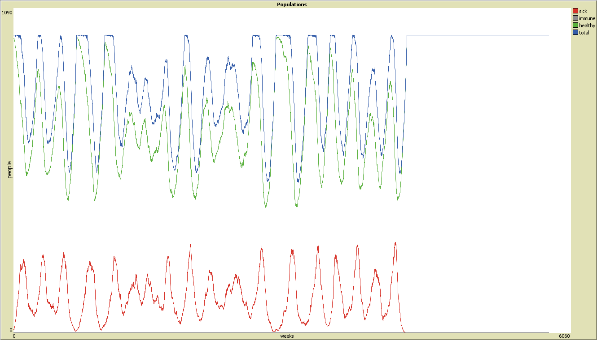

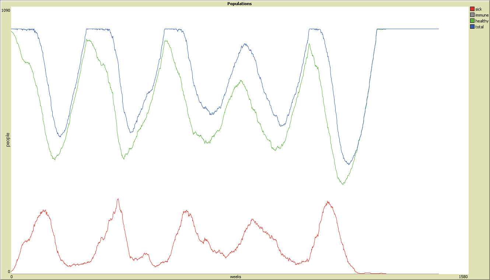

#### Contagiosité : 60% | Chances de guérison : 0% | Durée de l'immunité : 52 semaines

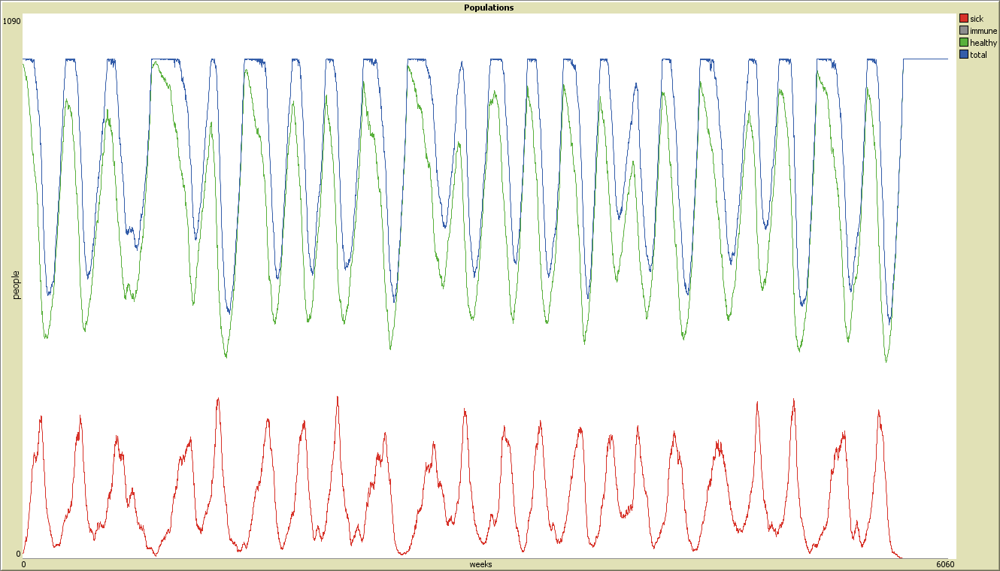

 
#### Contagiosité : 60% | Chances de guérison : 25%

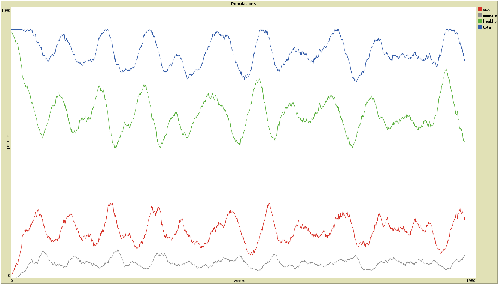

#### Contagiosité : 75% | Chances de guérison : 0%

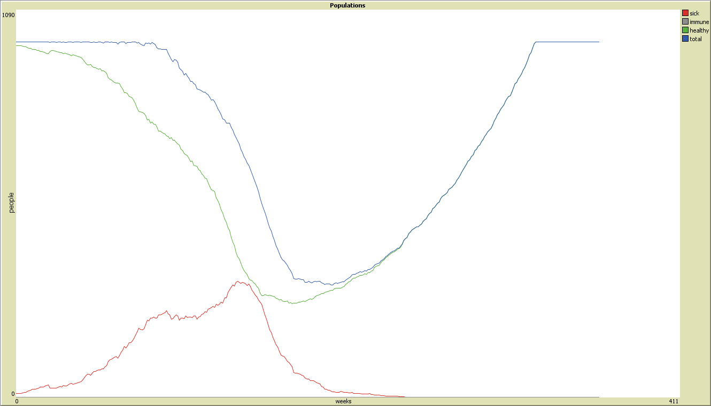

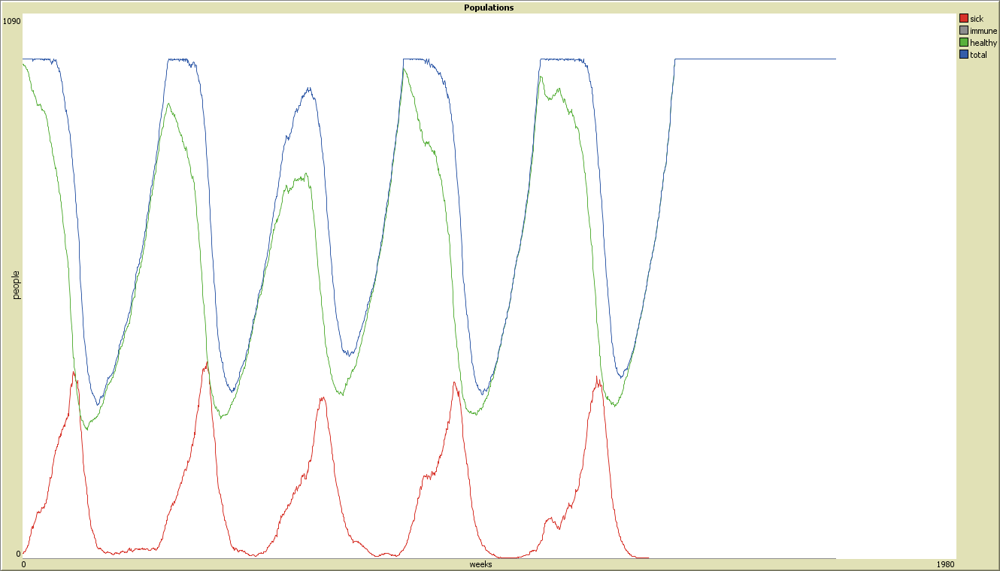

#### Contagiosité : 75% | Chances de guérison : 10%

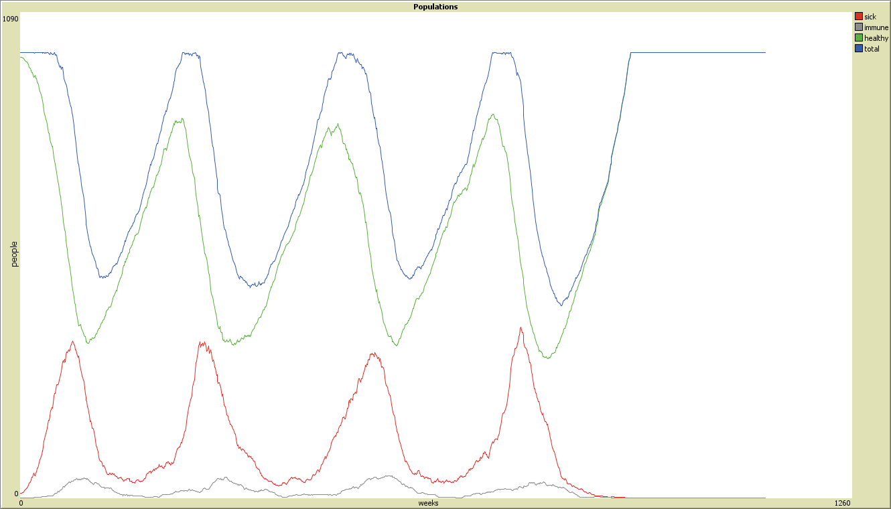

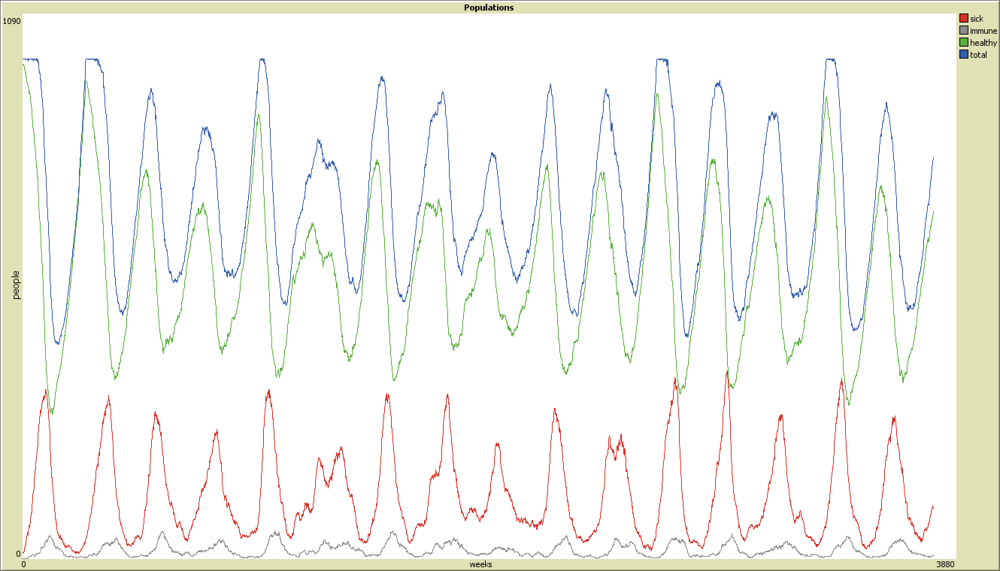

#### Contagiosité : 100% | Chances de guérison : 10%

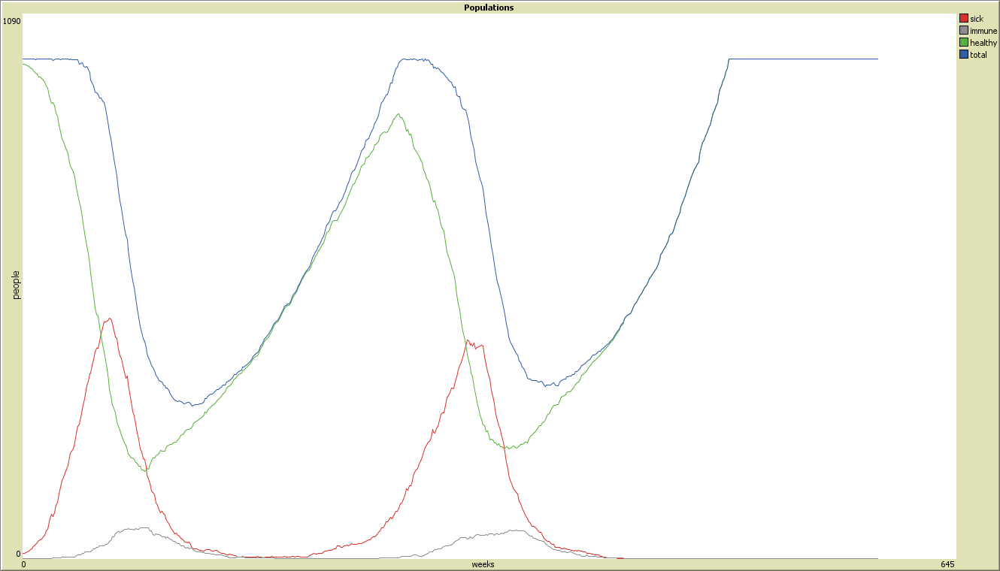

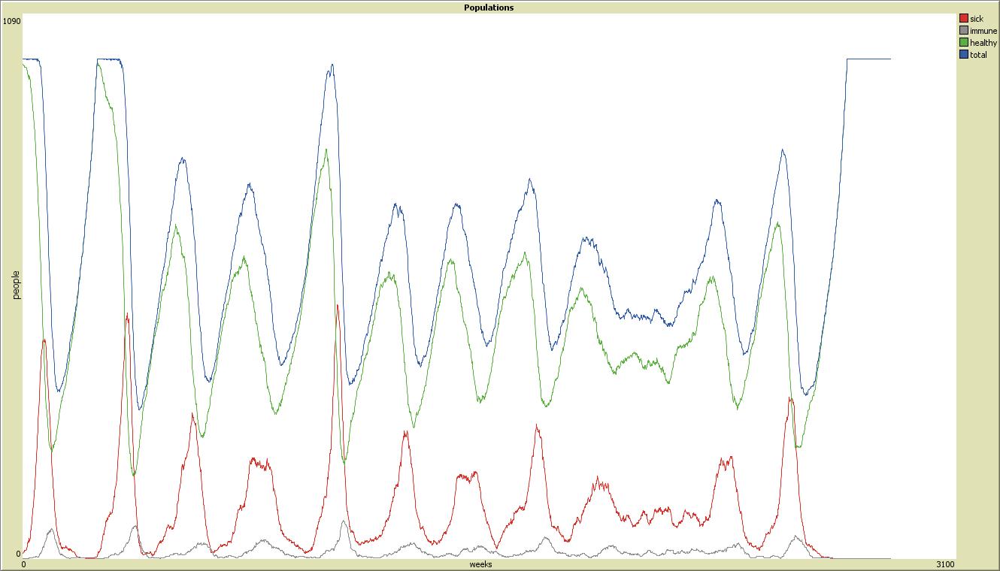

### b. Mesures de contrôle 

En adoptant des mesures sanitaire comme la vaccination (chances de guérison : 100%) ou la productions de médicaments (chances de guérison : 75%), on observe que variations 
infimes dans la populations (de l'ordre de 1 à 2 pourcent) lorsque la contagiosité est au plus bas ou que les chances de guérison sont au plus haut. Lorsque la contagiosité 
est de 75% ou de 100% avec 50% de chances de guérison, on observe de plus grandes fluctuations dans la population, entre 10 et 20 pourcent par rapport à la population initiale. 

#### Contagiosité : 60% | Chances de guérison : 50%

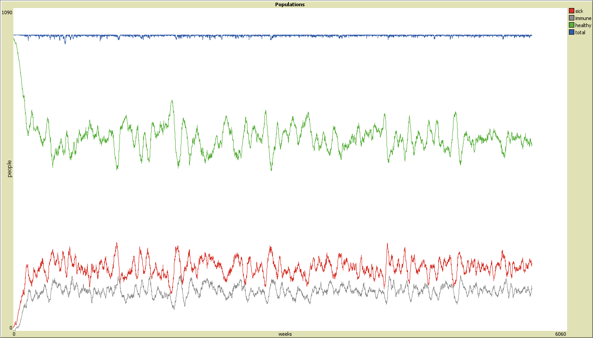

#### Contagiosité : 60% | Chances de guérison : 50% | Durée de l'immunité : 52 semaines

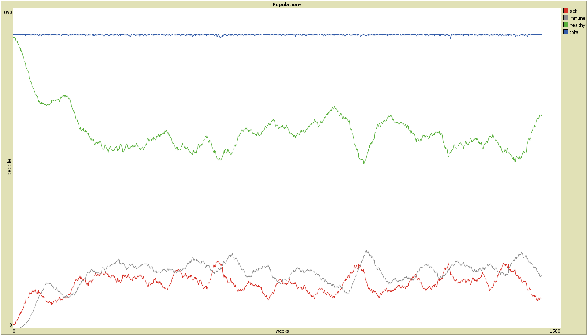

#### Contagiosité : 60% | Chances de guérison : 75%

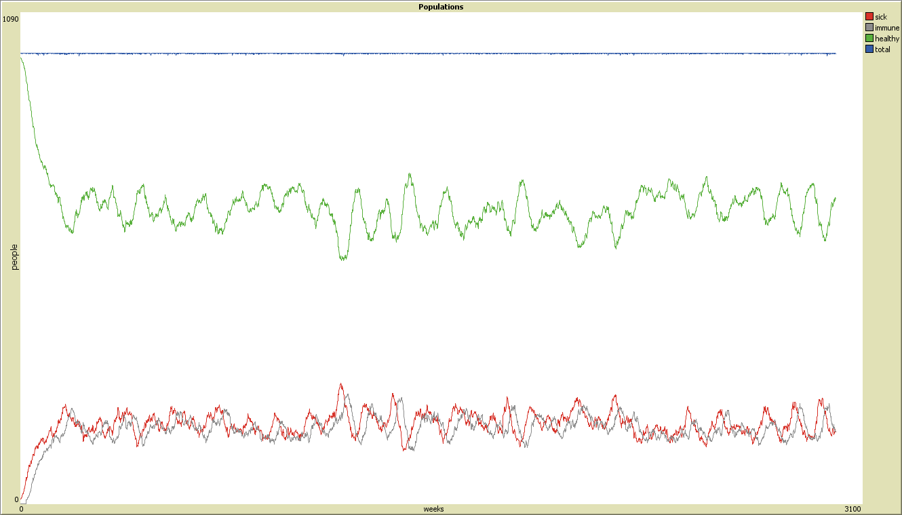

 
#### Contagiosité : 75% | Chances de guérison : 50%

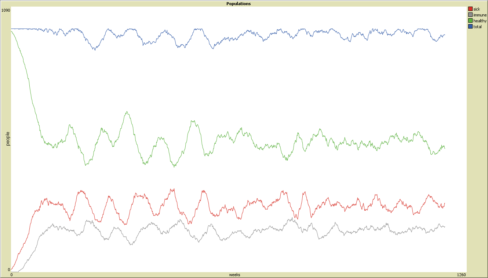

#### Contagiosité : 75% | Chances de guérison : 75%

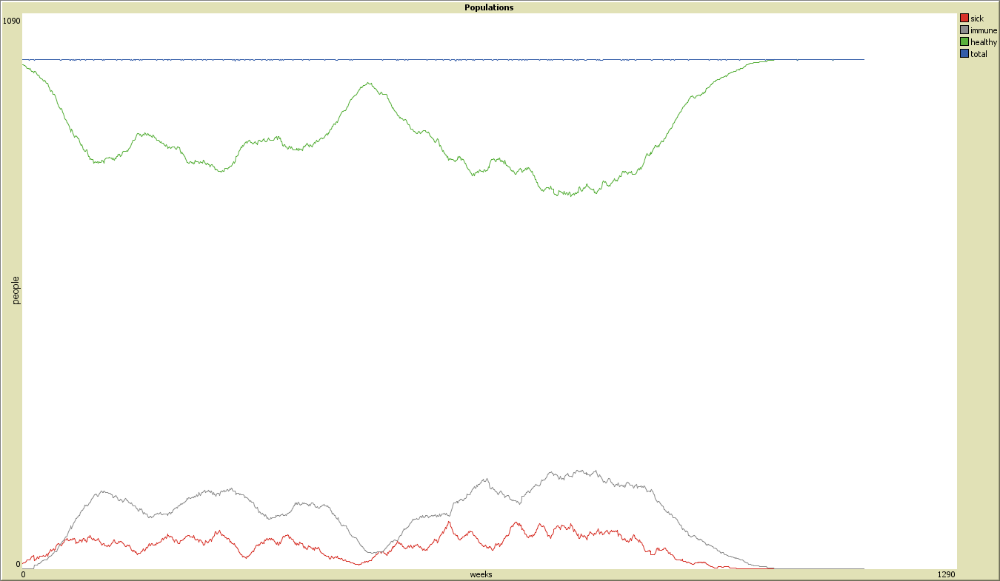

 
#### Contagiosité : 100% | Chances de guérison : 50%

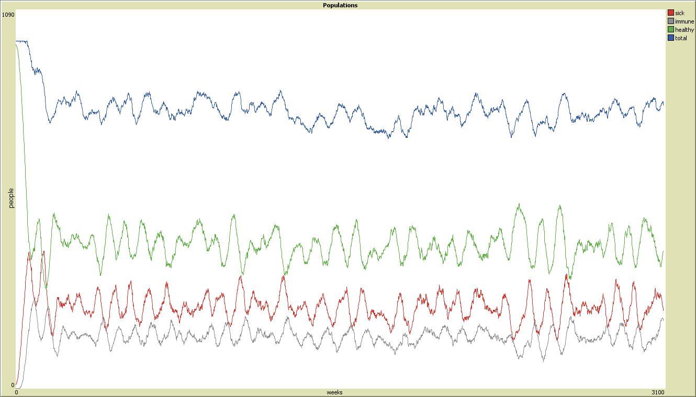

#### Contagiosité : 100% | Chances de guérison : 75%

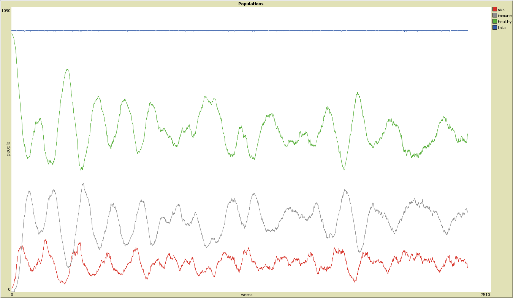

 
#### Contagiosité : toutes | Chances de guérison : 100%

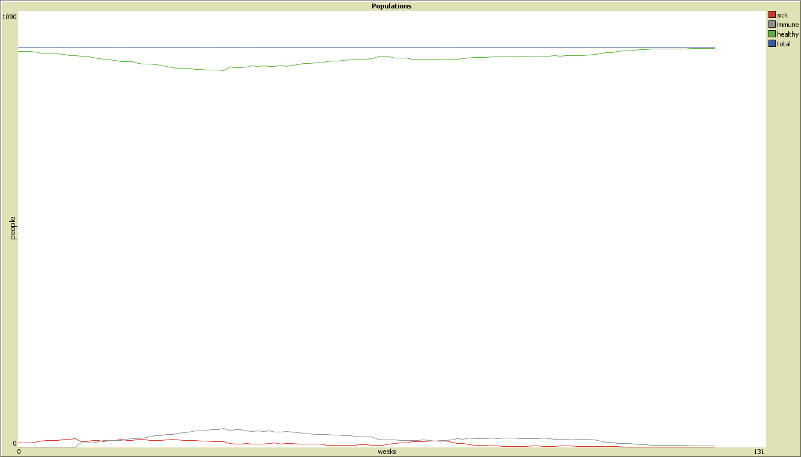

# 4. Conclusion 

Grâce aux résultats obtenus, nous avons pu constater qu'une MMHI est capable de disparaître d'elle-même après plusieurs années (ou siècle) si tous les agents infectés sont morts. 
Dans ce cas, avant la disparition complète nous avons une évolution cyclique de la population selon l'état des agents.
Mais dans la réalité nous voulons éviter cela, c'est pour cela que des mesures de contrôle telles que l'adoption d'un vaccin et la production de 
médicaments sont adoptées. Ces mesures permettent de réduire significativement les fluctuations dans la population, c'est-à-dire de limiter les pertes humaines. Même si le 
médicament montre une bonne efficacité, le vaccin reste le meilleur moyen de protéger la population.

