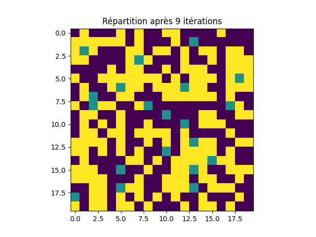
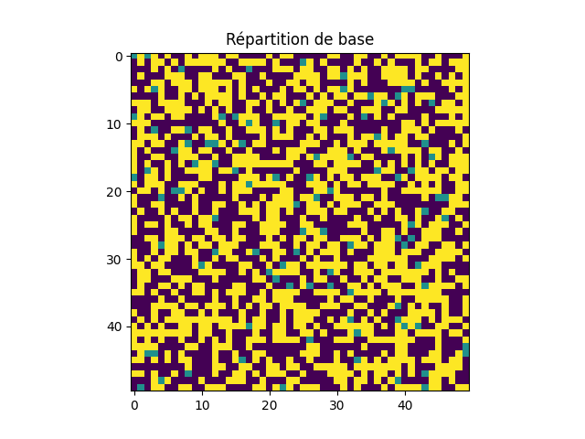

<h1 align="center"> Modèle de Schelling </h1>

<center>FIGINI Théo</center>
<center>30 NOVEMBRE 2021</center>

&nbsp;

## Sommaire
1. [Introduction](#introduction)  
2. [Présentation du modèle](#presenration-du-modele)  
   a. [Définition des paramètres](#definition-des-parametres)  
   b. [Présentation des individus](#presentation-des-individus)  
3. [Expériances éffectuées](#experiences-effectuees)  
   a. [Résultats Prévisibles](#resultats-previsibles)  
   b. [Répartitions stables](#repartitions-stables)  
   c. [Cas particuliers](#cas-particuliers)  
4. [Conclusion](#conclusion)  

&nbsp;  

# 1. Introduction  <a name="introduction"></a>

<div style="text-align: justify">
Cette simulation a pour but de montrer comment le modèle de ségrégation de Schelling peut être utilisé pour simuler un système de répartition de populations mobiles.
Nous étudirons la façon dont les individus de répartissent dans un espace définis et durant les expériences, nous ferons varier plusieurs paramètres
afin d'observer leur impact sur les populations. Notre problématique est la suivante : comment se répartissent les populations d'individus selon leur entourage ?
Pour cela nous présenterons le modèle utilisé, les expériences menées et les résultats obtenus.
</div>

## 2. Présentation du modèle  <a name="presenration-du-modele"></a>

### a. Définition des paramètres  <a name="definition-des-parametres"></a>

<div style="text-align: justify">
Pour ce modèle, les paramètres que nous allons utiliser sont les suivants :
<ul>
	<li> la durée de la simulation. (Constante : 10 000)  </li>  
	<li> la taille du monde dans lequel les individus vont se déplacer. (Valeurs possibles : 10, 20, 50) </li> 
	<li> le seuil de tolérance des individus, il s'agit d'un pourcentage. (Valeurs possibles : 0.1, 0.25, 0.5, 0.75, 1.0) </li>  
	<li> la densité de la population. (Cette variable est issue d'un calcul expliqué au point n°3) </li>
</ul>
</div>

### b. Présentation des individus  <a name="presentation-des-individus"></a>

<div style="text-align: justify">
Les individus sont représentés par des carrés colorés de taille 1x1, les carrés jaunes et violets représentent chacun une population d'individu et les carrés turquoises 
représentent las cases vides. L'insatisfaction des individus est déterminé par leur voisinage, c'est-à-dire les cases adjacentes à l'individu (cela 
inclut également les diagonales), et le seuil de tolérance définis. Ils se déplacent dans un monde dont la taille est définie au début de l'expérience, 
les individus chercheront à se déplacer de façon à être satisfait de leur voisinage. L'instatisfaction d'un individu est calculé à l'aide de la fonction suivante :
</div>

```{python}
def insat(world, i, j, size):
	u = 0

	if world[(i+1) % size, (j+1) % size] != 0 and world[(i+1) % size, (j+1) % size] != world[i, j]:
		u += 1
	if world[(i+1) % size, (j) % size] != 0 and world[(i+1) % size, (j) % size] != world[i, j]:
		u += 1
	if world[(i+1) % size, (j-1) % size] != 0 and world[(i+1) % size, (j-1) % size] != world[i, j]:
		u += 1
	if world[(i) % size, (j+1) % size] != 0 and world[(i) % size, (j+1) % size] != world[i, j]:
		u += 1
	if world[(i) % size, (j-1) % size] != 0 and world[(i) % size, (j-1) % size] != world[i, j]:
		u += 1
	if world[(i-1) % size, (j+1) % size] != 0 and world[(i-1) % size, (j+1) % size] != world[i, j]:
		u += 1
	if world[(i-1) % size, (j) % size] != 0 and world[(i-1) % size, (j) % size] != world[i, j]:
		u += 1
	if world[(i-1) % size, (j-1) % size] != 0 and world[(i-1) % size, (j-1) % size] != world[i, j]:
		u += 1

	return u/8
```

<div style="page-break-after: always;"></div>

# 3. Expériences éffectuées  <a name="experiences-effectuees"></a>  

<div style="text-align: justify">
Comme expliqué précédemment, nous allons faire varier certains paramètres afin d'observer leur impact sur la population. La durée de la simulation est fixée à 10 000 itérations 
maximum dans le cas où aucune répartition stable n'est obtenue. Les individus évoluront successivement dans un monde de taille 10x10, 20x20 et 50x50, au-delà de cela les temps de calcul seraient
beaucoup trop longs. Le seuil de tolérance est un pourcentage exprimé sous la forme d'une valeur allant de 0 à 1, si l'insatisfaction d'un individu est supérieur à ce seuil il se déplacera. 
La densité d'une population est exprimé par la formule suivante ((taille_monde*taille_monde)//2) - N, le nombre de case vides dans le monde correspond à N*2.

N.B. : le symbole // est utilisé pour la division entière.
</div>

### a. Résultats prévisibles  <a name="resultats-previsibles"></a>

<div style="text-align: justify">
Nous commencerons cette étude par présenter les expériences où la valeur d'un ou plusieurs paramètres permettent d'obtenir le même résultat.  

Seuil de tolérance : 0.1  

Nous pourrons remarquer dans les expériences suivantes que lorsque le seuil de tolérance est fixé à 0.1, la simulation se termine après les 10 000 itérations. 
Cela s'explique par le fait que l'insatisfaction des individus est toujours supérieur au seuil et ne peuvent donc trouver une position qui puisse les satisfaire 
et ce peu importe la taille du monde ou la densité de la population. 
</div>

&nbsp;  
&nbsp;  

<div style="text-align: center">
<b>Taille du monde : 10x10 &nbsp;Densité d'une population : 40 individus</b>
</div>

|  |  |
| :--------------------------------: | :-----------------------------------: |
|               Fig. 1               |                Fig. 2                 |

<div style="page-break-after: always;"></div>
<div style="text-align: center">
<b>Taille du monde : 20x20 &nbsp;Densité d'une population : 180 individus</b>
</div>

|  |  |
| :--------------------------------: | :-----------------------------------: |
|               Fig. 3               |                Fig. 4                 |

<div style="text-align: center">
<b>Taille du monde : 20x20 &nbsp;Densité d'une population : 150 individus</b>
</div>

|  |  |
| :--------------------------------: | :-----------------------------------: |
|               Fig. 5               |                Fig. 6                 |
&nbsp;
<div style="text-align: center">
<b>Taille du monde : 50x50 &nbsp;Densité d'une population : 1200 individus</b>
</div>

|  |  |
| :--------------------------------: | :-----------------------------------: |
|               Fig. 7               |                Fig. 8                 |
&nbsp;
<div style="text-align: center">
<b>Taille du monde : 50x50 &nbsp;Densité d'une population : 1240 individus</b>
</div>

|  |  |
| :--------------------------------: | :-----------------------------------: |
|               Fig. 9               |                Fig. 10                |
&nbsp;

<div style="text-align: justify">
Nous pouvous observer sur ces graphique que, bien que les individus soient répartis de façon relativement homogène, ils ne sont pas satisfait de leur voisinage 
ce qui explique le fais que les populations dans leur ensembles soient quant à elles réparties de façon plus chaotique. De plus, nous n'observons que très peu de
différences entre la situation initiale et la situation finale. Les individus expriment constament le besoin de se déplacer pour se satisfaire de leur voisinage.
</div>

&nbsp;

<div style="text-align: justify">
Seuil de tolérance : 1.0  

À l'inverse, si le seuil de tolérance est fixé à 1.0, la simulation se termine immédiatement car un tel seuil signifie que l'individu est toujours satisfait de 
son voisinage.
</div>

&nbsp;

<div style="text-align: center">
<b>Taille du monde : 10x10 &nbsp;Densité d'une population : 40 individus</b>
</div>

|  |  |
| :--------------------------------: | :-----------------------------------: |
|              Fig. 11               |                Fig. 12                |

<div style="page-break-after: always;"></div>

<div style="text-align: center">
<b>Taille du monde : 20x20 &nbsp;Densité d'une population : 180 individus</b>
</div>

|  |  |
| :--------------------------------: | :-----------------------------------: |
|              Fig. 13               |                Fig. 14                |
&nbsp;

<div style="text-align: center">
<b>Taille du monde : 50x50 &nbsp;Densité d'une population : 1200 individus</b>
</div>

|  |  |
| :--------------------------------: | :-----------------------------------: |
|              Fig. 15               |                Fig. 16                |
&nbsp;

<div style="text-align: justify">
Nous voyons clairement qu'il n'y a eu aucun mouvement de la population, ils n'expriment donc aucun besoin de se déplacer. la répartition des individus est toujours 
la même quelle que la taille du monde et la densité de la population à laquelle ils appartiennent.
</div>

<div style="page-break-after: always;"></div>

### b. Répartitions stables <a name="repartitions-stables"></a>

<div style="text-align: justify">
En ajustant les valeurs de notre simulation il est possible de voir les individus de nos deux populations atteindre un état stable avant les  10 000 itérations.
Grâce aux graphiques que nous étudirons, nous pourrons voir que les individus se rassemblent avec les autres individus faisant partie de leur population.
En raison du nombres important de graphiques et afin de faciliter la compréhension, ces derniers sont ordonnés selon la taille du monde, la valeur croissante du seuil 
de tolérance et la densité décroissante de la population.
</div>
&nbsp;

### Taille du monde : 10x10
 
<div style="text-align: center">
<b>Seuil de tolérance : 0.25&nbsp;Densité d'une population : 40 individus</b>
</div>

|  |  |
| :---------------------------------: | :------------------------------------: |
|               Fig. 21               |                Fig. 22                 |
&nbsp;
<div style="text-align: center">
<b>Seuil de tolérance : 0.5 &nbsp;Densité d'une population : 40 individus</b>
</div>

|  |  |
| :--------------------------------: | :-----------------------------------: |
|              Fig. 17               |                Fig. 18                |

<div style="page-break-after: always;"></div>

<div style="text-align: center">
<b>Seuil de tolérance : 0.75 &nbsp;Densité d'une population : 40 individus</b>
</div>

|  |  |
| :---------------------------------: | :------------------------------------: |
|               Fig. 19               |                Fig. 20                 |
&nbsp;
<div style="text-align: center">
<b>Seuil de tolérance : 0.25 &nbsp;Densité d'une population : 30 individus</b>
</div>

|  |  |
| :---------------------------------: | :------------------------------------: |
|               Fig. 23               |                Fig. 24                 |

<div style="text-align: center">
<b>Seuil de tolérance : 0.5 &nbsp;Densité d'une population : 30 individus</b>
</div>

|  |  |
| :--------------------------------: | :-----------------------------------: |
|              Fig. 25               |                Fig. 26                |

<div style="page-break-after: always;"></div>

<div style="text-align: center">
<b>Seuil de tolérance : 0.75 &nbsp;Densité d'une population : 30 individus</b>
</div>

|  |  |
| :---------------------------------: | :------------------------------------: |
|               Fig. 27               |                Fig. 28                 |
&nbsp;

### Taille du monde : 20x20

<div style="text-align: center">
<b>Seuil de tolérance : 0.5 &nbsp;Densité d'une population : 190 individus</b>
</div>

|  |  |
| :--------------------------------: | :-----------------------------------: |
|              Fig. 29               |                Fig. 30                |

<div style="text-align: center">
<b>Seuil de tolérance : 0.75 &nbsp;Densité d'une population : 190 individus</b>
</div>

|  |  |
| :---------------------------------: | :------------------------------------: |
|               Fig. 31               |                Fig. 32                 |

<div style="text-align: center">
<b>Seuil de tolérance : 0.25 &nbsp;Densité d'une population : 180 individus</b>
</div>

|  |  |
| :---------------------------------: | :------------------------------------: |
|               Fig. 33               |                Fig. 34                 |

<div style="text-align: center">
<b>Seuil de tolérance : 0.5 &nbsp;Densité d'une population : 180 individus</b>
</div>

|  |  |
| :--------------------------------: | :-----------------------------------: |
|              Fig. 35               |                Fig. 36                |

<div style="text-align: center">
<b>Seuil de tolérance : 0.75 &nbsp;Densité d'une population : 180 individus</b>
</div>

|  |  |
| :---------------------------------: | :------------------------------------: |
|               Fig. 37               |                Fig. 38                 |

<div style="page-break-after: always;"></div>

<div style="text-align: center">
<b>Seuil de tolérance : 0.25 &nbsp;Densité d'une population : 150 individus</b>
</div>

|  |  |
| :---------------------------------: | :------------------------------------: |
|               Fig. 38               |                Fig. 39                 |

<div style="text-align: center">
<b>Seuil de tolérance : 0.5 &nbsp;Densité d'une population : 150 individus</b>
</div>

|  |  |
| :--------------------------------: | :-----------------------------------: |
|              Fig. 40               |                Fig. 41                |

<div style="text-align: center">
<b>Seuil de tolérance : 0.75 &nbsp;Densité d'une population : 150 individus</b>
</div>

|  |  |
| :---------------------------------: | :------------------------------------: |
|               Fig. 42               |                Fig. 43                 |

<div style="page-break-after: always;"></div>

### Taille du monde : 50x50

<div style="text-align: center">
<b>Seuil de tolérance : 0.5 &nbsp;Densité d'une population : 1240 individus</b>
</div>

|  |  |
| :--------------------------------: | :-----------------------------------: |
|              Fig. 44               |                Fig. 45                |

<div style="text-align: center">
<b>Seuil de tolérance : 0.5 &nbsp;Densité d'une population : 1230 individus</b>
</div>

|  |  |
| :--------------------------------: | :-----------------------------------: |
|              Fig. 46               |                Fig. 47                |

<div style="text-align: center">
<b>Seuil de tolérance : 0.75 &nbsp;Densité d'une population : 1230 individus</b>
</div>

|  |  |
| :---------------------------------: | :------------------------------------: |
|               Fig. 48               |                Fig. 49                 |
&nbsp;
<div style="text-align: center">
<b>Seuil de tolérance : 0.5 &nbsp;Densité d'une population : 1200 individus</b>
</div>

|  |  |
| :--------------------------------: | :-----------------------------------: |
|              Fig. 50               |                Fig. 51                |

<div style="text-align: center">
<b>Seuil de tolérance : 0.75 &nbsp;Densité d'une population : 1200 individus</b>
</div>

|  |  |
| :---------------------------------: | :------------------------------------: |
|               Fig. 52               |                Fig. 53                 |
&nbsp;

<div style="text-align: justify">
À l'aide de des graphiques ci-dessus, nous constatons que pour un monde de 10x10, un seuil de tolérance de 0.25 est suffisant pour obtenir rapidement des populations 
stables indépendamment de la densité, sauf pour un cas particulier que nous verrons plus tard.  

Pour un monde de 20x20, un seuil de tolérance de 0.25 est également suffisant pour obtenir rapidement des populations stables sauf dans le cas où la densité 
de chaque population est de 190 individus, soit 20 cases vides dans le monde. Pour rappel, la densité d'une population se calcule à l'aide de la formule suivante :
((taille_monde\*taille_monde)//2) - N, le nombre de cases vides dans le monde est N\*2.  

Dans le cas d'un monde de 50x50, nous observons qu'un seuil de tolérance minimum de 0.5 est nécessaire pour obtenir une population stable. Cela peut s'expliquer
par une plus grande densité de population que dans un monde de 10x10 ou de 20x20, où les individus ont plus de chances d'avoir un voisinage dont ils ne sont 
pas satisfaits.
</div>

<div style="page-break-after: always;"></div>

### Cas particuliers <a name="cas_particuliers"></a>

<div style="text-align: justify">
Il arrive parfois que certaines valeurs fournissent des résultats inexploitables ou des résultats trompeurs mais qui toutefois restent intéressants à étudier 
dans le cadre de notre recherche.

#### Cas particulier 1 : Tailles du monde : 10x10 &nbsp;N = 50

<div style="text-align: center">
<b>Seuil de tolérance : tous<b>
</div>

|  |  |
| :--------------------------------: | :-----------------------------------: |
|              Fig. 54               |                Fig. 55                |

<div style="text-align: justify">
L'exemple ci-dessus montre que pour un monde de taille 10x10 (c'est-à-dire 100 cases) et à cause de la façon dont la densité est calculée ce qui génère 100 cases vides 
d'un point de vue algoritmique, nous pouvons voir que le monde de notre simulation est entièrement occupé par des individus d'une même population.

#### Cas particulier 2 : Tailles du monde : 50x50 &nbsp;Seuil de tolérance : 0.25

<div style="text-align: center">
<b>Densité des populations : toutes</b>
</div>

|  |  |
| :---------------------------------: | :------------------------------------: |
|               Fig. 56               |                Fig. 57                 |

<div style="text-align: justify">
Dans le cas présent, pour un monde de 50x50 et seuil de tolérance de 0.25, nous observons ce que nous avons appelé une "fausse stabilité". À la fin de la simulation, 
la répartition des populations semble stabe mais l'arrêt à la 10 000ème itération montre que les populations sont toujours en phase d'évolution.

<div style="page-break-after: always;"></div>

# 4. Conclusion <a name="conclusion"></a>

<div style="text-align: justify">
Grâce à nos simulations, nous pouvons affirmer que le facteur le plus déterminant dans la répartion des populations est le seuil de tolérance des individus qui les compose.
En effet, nous remarquons que plus ce seuil est bas plus les individus exprime le besoin de former des groupes avec des individus similaires, à l'inverse, plus ce seuil est 
élevé plus les individus et moins les individus exprime le besoin de se déplacer, ce qui donne lieu à une répartion plus chaotique. Nous avons pu noter que lorsque la taille 
du monde augmente, la densité des populations devient un paramètre important car plus les populations comptent d'individus, plus il est nécessaire de définir une tolérance 
élevée afin d'atteindre un répartion stable. Ces données nous permettent de conclure que la taille du monde impacte peu la répartion mais joue toujours un rôle dans l'étude.
</div>